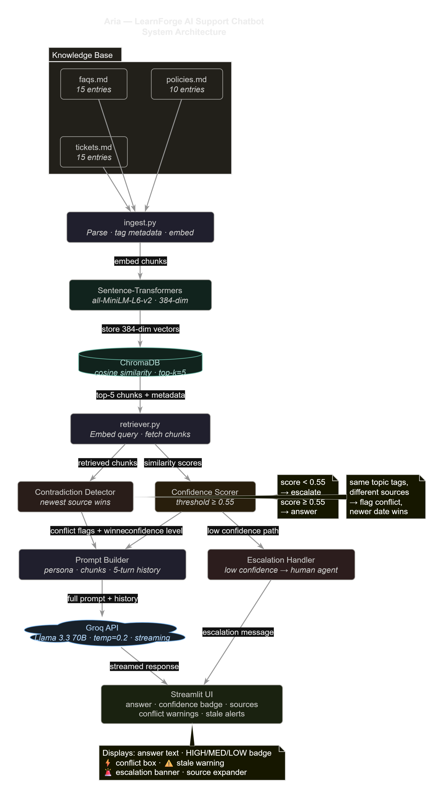

# 🎓 ForgeAssist-ARIA

> **ForgeAssist-ARIA** is an AI-powered customer support assistant for LearnForge (ed-tech) built with Groq, ChromaDB, and Sentence-Transformers. Handles multi-turn conversations, eliminates hallucinations via grounded RAG, dynamically detects contradictions and outdated policies in the knowledge base, and escalates gracefully when confidence falls below threshold.


---

## 📋 Table of Contents

1. [Quick Start](#-quick-start)
2. [Architecture](#-architecture)
3. [Data Schema](#-data-schema)
4. [Key Features](#-key-features)
5. [Failure Handling](#-failure-handling)
6. [Eval Plan](#-eval-plan)
7. [Trade-offs](#-trade-offs)
8. [What I'd Do With More Time](#-what-id-do-with-more-time)

---

## 🚀 Quick Start

### 1. Clone the repo

```bash
git clone https://github.com/AwaisKhaleeq/ForgeAssist-ARIA.git
cd ForgeAssist-ARIA
```

### 2. Install dependencies

```bash
pip install -r requirements.txt
```

> First run will download `all-MiniLM-L6-v2` (~80 MB) automatically.

### 3. Set up your Groq API key

```bash
cp .env.example .env
# Edit .env and paste your key from https://console.groq.com
```

### 4. Ingest the knowledge base

```bash
python -m chatbot.ingest
```

Expected output:
```
📚 Loading knowledge base files …
   Parsed 40 chunks total (15 FAQs, 10 policies, 15 tickets)
🔢 Loading embedding model: all-MiniLM-L6-v2 …
   Embedding all chunks …
🗄️  Connecting to ChromaDB …
✅ Ingestion complete. Collection 'learnforge_kb' now has 40 documents.
```

### 5. Run the chatbot

```bash
streamlit run app.py
```

Open `http://localhost:8501` in your browser.

---

## 🏗️ Architecture



```
┌─────────────────────────────────────────────────────────────────┐
│                        STREAMLIT UI (app.py)                    │
│   Multi-turn chat  │  Confidence badges  │  Source expanders    │
│   Escalation banners │ Contradiction warnings │ Stale alerts    │
└────────────────────────────┬────────────────────────────────────┘
                             │ user query
                             ▼
                  ┌──────────────────────┐
                  │   chatbot/retriever  │
                  │  Embed query with    │
                  │  all-MiniLM-L6-v2   │
                  └──────────┬───────────┘
                             │ 384-dim normalised vector
                             ▼
                  ┌──────────────────────┐
                  │  ChromaDB (cosine)   │
                  │  PersistentClient    │
                  │  top-k=5 chunks      │
                  └──────────┬───────────┘
                             │ docs + metadata + distances
                             ▼
              ┌──────────────────────────────┐
              │  Contradiction Detector       │
              │  • Same topics, diff sources  │
              │  • Stale-flagged chunks       │
              │  • Winner = higher date_key   │
              └──────────────┬───────────────┘
                             │
                             ▼
              ┌──────────────────────────────┐
              │  Confidence Scorer           │
              │  similarity ≥ 0.55 → answer  │
              │  similarity < 0.55 → escalate│
              └──────────────┬───────────────┘
                             │
              ┌──────────────┴───────────────┐
              │                              │
              ▼                              ▼
  ┌─────────────────────┐      ┌──────────────────────────┐
  │  prompt_builder     │      │  escalation_prompt       │
  │  • System persona   │      │  • Polite "I don't know" │
  │  • Context chunks   │      │  • Route to human agent  │
  │  • Contradiction    │      └──────────────────────────┘
  │    warnings         │
  │  • Last 5 turns     │
  └──────────┬──────────┘
             │
             ▼
  ┌──────────────────────┐
  │  Groq API            │
  │  llama-3.3-70b       │
  │  temp=0.2, stream=✓  │
  └──────────┬───────────┘
             │ token stream
             ▼
  ┌──────────────────────┐
  │  Response + Metadata │
  │  • Answer text       │
  │  • Confidence badge  │
  │  • Source citations  │
  │  • Conflict warnings │
  │  • Stale notices     │
  └──────────────────────┘
```

---

## 📦 Data Schema

Each document chunk stored in ChromaDB has the following fields:

| Field | Type | Description | Example |
|-------|------|-------------|---------|
| `id` | `str` | Unique chunk ID | `faq-02-chunk-0` |
| `document` | `str` | Full raw text of the chunk | `"# FAQ-02 — Can I get a refund…"` |
| `embedding` | `list[float]` | 384-dim cosine-normalised vector | `[0.012, -0.034, …]` |
| `source_file` | `str` | Origin filename | `faqs.md` / `policies.md` / `tickets.md` |
| `doc_type` | `str` | Document category | `faq` / `policy` / `ticket` |
| `doc_id` | `str` | Unique document identifier | `FAQ-02`, `POLICY-02`, `TICKET-08` |
| `title` | `str` | Section heading | `"Can I get a refund for a course?"` |
| `last_reviewed` | `str` | Human-readable date from the doc | `"January 2026"` / `"unknown"` |
| `date_sort_key` | `int` | YYYYMM integer for recency sorting | `202601` |
| `is_outdated_flag` | `str` | `"True"` if doc explicitly flags stale content | `"True"` |
| `chunk_index` | `int` | Position within parent doc (always 0 here) | `0` |
| `topics` | `str` | Comma-separated topic tags | `"refund,payment"` |

### Why one chunk per entry?

Each FAQ, policy, and ticket is stored as a **single chunk**. This is a deliberate design choice:

- FAQs and policies are already self-contained units of meaning
- Splitting mid-chunk would risk returning only half an answer (e.g., the question but not the answer, or the policy header but not the key date)
- The longest chunks are ~600 tokens — well within any LLM's context window
- With 40 total chunks, retrieval precision matters more than recall

### Topic Tags

Topics are auto-assigned at ingest time via regex rules. Available tags:

`refund`, `subscription`, `payment`, `certificate`, `progress`, `offline`, `account_security`, `account_management`, `accessibility`, `mobile`, `video_playback`, `account_sharing`, `technical`

These power the contradiction detector: two chunks with overlapping topics from different sources trigger a conflict check.

---

## ✨ Key Features

### 1. Retrieval-Augmented Generation (RAG)
Every response is grounded in the knowledge base. The LLM **cannot** answer from parametric memory alone — it is explicitly instructed to use only the provided context, and the system prompt states: *"If the context does not cover the question, say so clearly — do NOT make up information."*

### 2. Contradiction Detection
The knowledge base intentionally contains contradictions (e.g., `POLICY-02` says 14-day refund window; `TICKET-03` references a 30-day guarantee; an older article mentioned 7 days). The system:
1. Identifies chunks that share topic tags but come from different source files
2. Identifies chunks that explicitly flag outdated content
3. Selects the **most recently reviewed** chunk as authoritative
4. Surfaces a ⚡ conflict warning in the UI explaining which source was preferred and why

### 3. Confidence-Based Escalation
After vector search, the top cosine similarity score is compared to a configurable threshold (`0.40`). If similarity is below threshold:
- The bot generates a polite "I don't know" message using a separate escalation prompt
- The UI shows a red 🚨 Escalated banner with contact details
- Session stats track escalation rate

### 4. Multi-Turn Memory
The last **5 conversation turns** (10 messages) are injected into every prompt under a `[Conversation History]` section. This lets users say "what about Apple Pay?" in a follow-up without re-explaining context.

### 5. Stale Data Handling
Chunks containing phrases like "outdated," "older version," "no longer applies" are tagged `is_outdated_flag=True` at ingest. The UI shows an ⚠️ Stale Source badge and a warning box when stale chunks are surfaced.

---

## 🔥 Failure Handling

| Failure Mode | Detection | Response |
|---|---|---|
| **Low confidence (no relevant chunks)** | Top similarity < 0.40 | Escalation prompt + human agent contact |
| **Contradictory sources** | Same topic, different source files | Conflict flagged; newest source authoritative |
| **Stale / outdated content** | Regex patterns at ingest time | ⚠️ badge + staleness notice in UI |
| **Knowledge gap (topic not in KB)** | Low similarity scores | Escalate; never hallucinate |
| **Groq API error** | Exception catch in streaming loop | User-facing error message with troubleshooting tip |
| **ChromaDB not ingested** | Collection count check at startup | UI warning + one-click ingestion button |
| **Duplicate payment confusion** | Ticket patterns (TICKET-02, -14) | Surface relevant FAQ-04 + policy guidance |
| **Ambiguous user intent** | Low similarity + vague query | Ask clarifying question OR escalate |
| **Multi-device sync confusion** | Progress-related retrieval | POLICY-06 + FAQ-03 context injected |

### Stale Data Strategy in Detail

The knowledge base has several explicitly flagged contradictions:
- **POLICY-01**: "annual subscriptions billed monthly" (old) vs. annual charge at checkout (new)
- **POLICY-02**: "7-day refund period for all digital products" (archived) vs. 14-day standard (current)
- **FAQ-07**: "desktop download feature" mentioned in older articles; now mobile-only
- **POLICY-03**: captioning requirement changed from "required" to "whenever practical"

At ingest, these are caught by regex patterns and tagged. At retrieval, the contradiction detector prefers the chunk with the higher `date_sort_key` (YYYYMM) and tells the LLM which source to trust.

---

## 📊 Eval Plan

### How I'd Measure Quality in Production

#### 1. Retrieval Quality (Offline)
- Build a **golden dataset** of 50 question → expected_doc_id pairs
- Measure **Recall@k** (does the relevant chunk appear in top-k?) and **MRR** (mean reciprocal rank)
- Threshold: Recall@5 ≥ 0.85

#### 2. Hallucination Rate
- Manually label 100 LLM responses: does the answer contain facts NOT in the retrieved chunks?
- Automated approach: extract all factual claims from the response and verify each against the source chunks using a secondary LLM judge prompt
- Target: < 5% hallucination rate

#### 3. Answer Faithfulness (LLM-as-Judge)
- Feed (question, context, answer) to a judge LLM (e.g., a second Groq call)
- Prompt: *"Score 1-5: Is this answer fully supported by the context? Does it contradict any retrieved source?"*
- Target: average faithfulness score ≥ 4.0

#### 4. Escalation Calibration
- Track: escalation rate per topic over time
- If escalation rate for "refund" questions > 20%, the refund-related chunks need better coverage
- Log all escalated queries for human review to identify KB gaps

#### 5. User Satisfaction (Production)
- Thumbs up/down button on each response
- A/B test confidence thresholds: 0.35 vs. 0.40 vs. 0.45
- Track conversation length: longer = user not getting answers quickly enough

#### 6. Contradiction Detection Accuracy
- Manually create 20 questions that span contradicted topics
- Verify that conflict warnings appear and the correct (newer) source is cited

---

## ⚖️ Trade-offs

### ChromaDB over Pinecone / Weaviate
**Why ChromaDB:** Zero setup, Python-native, runs entirely locally with no API keys or signup. For a 40-document knowledge base, managed cloud vector stores add complexity without benefit. ChromaDB's PersistentClient gives durability without a running server process.

**What you'd lose at scale:** ChromaDB doesn't support distributed sharding or real-time index updates without a full re-ingest. At 10M+ documents, Pinecone or Qdrant would be better choices.

### Groq (Llama 3.3 70B) over GPT-4
**Why Groq:** Free tier with 14,400 req/day, ~150 tokens/second (fastest inference available), and Llama 3.3 70B performs comparably to GPT-4o on factual Q&A tasks. No credit card required.

**What you'd lose:** GPT-4o has better instruction-following for edge cases and a larger context window. For a production system, I'd benchmark both.

### Sentence-Transformers (all-MiniLM-L6-v2) over OpenAI embeddings
**Why local embeddings:** No API cost, no latency for embedding calls, runs on CPU in ~50ms per query, and all-MiniLM-L6-v2 achieves strong performance on semantic similarity benchmarks for its size (80MB).

**What you'd lose:** OpenAI's `text-embedding-3-large` (3072 dims) has ~8% better MTEB scores. For a 40-doc KB, this difference is negligible.

### One chunk per document entry vs. sentence-level chunking
**Why one chunk per entry:** FAQs and policies are written as self-contained answers. Splitting them would risk returning only half the context (e.g., just the question header without the answer body). The longest chunks are ~600 tokens, which is fine for a 4K+ context LLM.

**What you'd lose:** With a much larger KB (thousands of documents), fine-grained chunking with overlap would improve precision by allowing the retriever to pinpoint the exact paragraph rather than returning the whole document.

### Temperature = 0.2
**Why low temperature:** Support chatbots need consistency and factual accuracy, not creativity. A low temperature keeps the model "on the rails" of the retrieved context.

**What you'd lose:** Edge cases where a bit more flexibility would help paraphrase or explain a concept more naturally.

### Top-k = 5
**Why 5:** Balances context richness with prompt size. At 40 total chunks, retrieving 5 covers 12.5% of the KB per query — enough to catch cross-topic contradictions without overwhelming the prompt.

---

## ⏱️ What I'd Do With More Time

1. **Hybrid search** — combine BM25 keyword search with vector search (RRF fusion) for better recall on exact-match queries like order numbers or specific policy names

2. **Fine-tuned reranker** — add a cross-encoder reranker (e.g., `ms-marco-MiniLM-L-6-v2`) after retrieval to reorder chunks by true relevance before building the prompt

3. **Structured output** — use Groq's JSON mode to extract `answer`, `confidence`, `sources_cited`, and `follow_up_needed` as structured fields, making the response easier to log and evaluate

4. **Query reformulation** — before retrieval, use a cheap LLM call to expand / clarify the user's query (e.g., "cancel" → "cancel subscription OR cancel enrollment OR cancel payment")

5. **Async ingestion pipeline** — watch the KB files for changes and automatically re-ingest modified documents without a full reset

6. **Evaluation harness** — build an automated eval suite using the 15 tickets as golden examples: given the user's question, does the bot cite the same resolution?

7. **Session persistence** — store conversation history in SQLite so sessions survive page refreshes

8. **Admin dashboard** — Streamlit page showing escalation trends, most common queries, and chunks with lowest retrieval scores (indicating KB gaps)

---

## 📁 Project Structure

```
AI Engineer Job NSTP/
├── faqs.md                  # 15 FAQ entries
├── policies.md              # 10 policy documents
├── tickets.md               # 15 support ticket transcripts
├── chatbot/
│   ├── __init__.py
│   ├── ingest.py            # Parse + embed + store in ChromaDB
│   ├── retriever.py         # Vector search + contradiction detection
│   ├── confidence.py        # Confidence scoring + escalation logic
│   ├── prompt_builder.py    # Prompt assembly with multi-turn context
│   └── llm_client.py        # Groq API streaming wrapper
├── app.py                   # Streamlit frontend
├── chroma_db/               # Auto-created persistent vector store
├── requirements.txt
├── .env.example             # Template for GROQ_API_KEY
└── README.md
```

---

## 📄 License

MIT — free to use, modify, and distribute.
